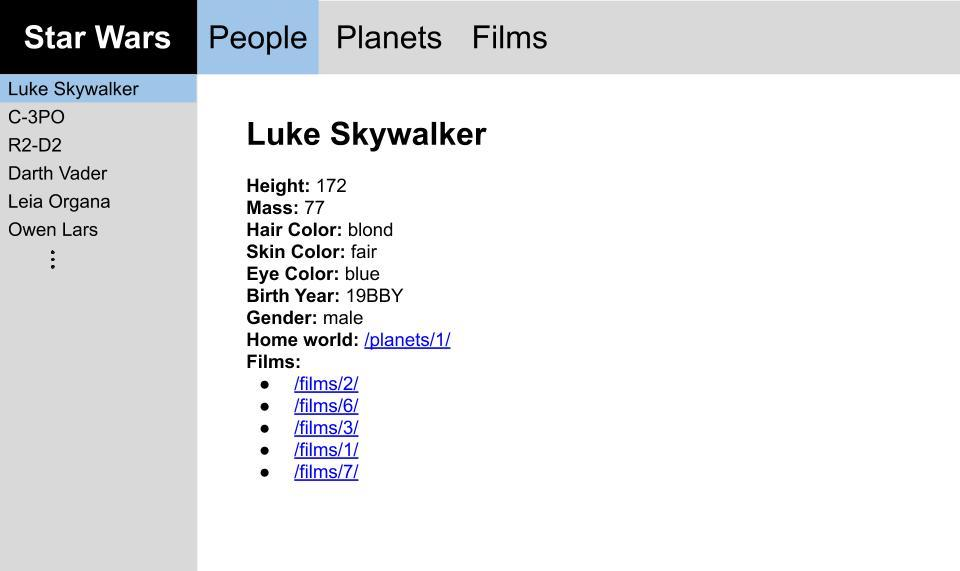

## Starwars Application using the Starwars API

The application you write should contain three main structural elements, each of which is described below.  Importantly, you must use React Router to implement the application's navigational features.

## Navbar

The navbar should span the top of the application and should contain four things: a site title that links to the application's homepage (i.e. the root URL path, `/`), and three links to navigate to each of the "people", "planets", and "films" pages.  The link corresponding to the page that's currently "active" should be highlighted.

## Sidebar

The sidebar should be positioned along the left side of the page and should contain a list of all of the elements in the data category corresponding to the "active" link in the navbar.  In other words, if the user clicks the "people" link in the navbar, then a list of all of the characters from `people.json` should appear in the sidebar.  The data elements in the sidebar should be listed by name/title, as appropriate.

Each data element in the sidebar should be a link that functions as described below.  As with the navbar, the "active" sidebar link should be highlighted.

If you can, try to implement the sidebar in such a way that it can be scrolled independently of the rest of the page.

## Main content pane

The main content pane should be positioned at the center of the application.  It should occupy all of the viewport space not occupied by the navbar or the sidebar.  When the user clicks on one of the sidebar links, a detailed view of the corresponding data element should be displayed in the main content pane.  For example, if the user clicks "Luke Skywalker" in the sidebar, a detailed view of the Luke Skywalker data should be displayed in the main content pane.

The detailed view should display all data fields for the corresponding data element, whatever type of element it happens to be (i.e. person, planet, or film).  To make this easier, it might make sense to implement a separate component to display each different type of data element (e.g. `<Person>`, `<Planet>`, and `<Film>`).

For all data types, any data fields that contain an array should be rendered as an unordered list, and any data fields that refer to other data elements should be rendered as links to those elements.  For example, a person's `homeworld` field should be rendered as a link to the corresponding planet, and a film's `characters` field should be rendered as an unordered list of links to the corresponding people.

If no element from the sidebar is "active" (e.g. when the user first clicks a link in the navbar), then the main content pane should contain some simple text related to the "active" navbar link.
